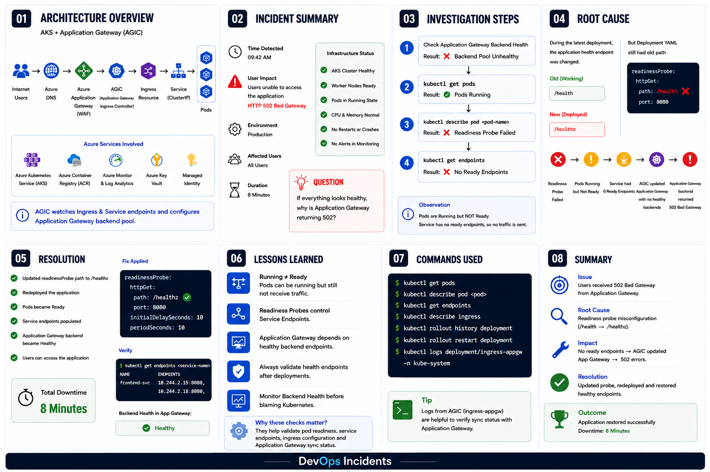

# AKS 502 Bad Gateway due to Readiness Probe Misconfiguration

## Overview

A production deployment caused Azure Application Gateway to return **HTTP 502 Bad Gateway** even though the AKS cluster, worker nodes, and pods appeared healthy.

---

## Architecture



---

## Technologies Used

- Azure Kubernetes Service (AKS)
- Azure Application Gateway
- AGIC
- Kubernetes Ingress
- Kubernetes Service
- Readiness Probe

---

## Symptoms

- Users received HTTP 502 Bad Gateway
- Pods were Running
- Backend pool was unhealthy
- No application crashes
- No CPU or memory issues

---

## Investigation

### Step 1

Check Application Gateway Backend Health.

Result:

❌ Backend Unhealthy

### Step 2

```bash
kubectl get pods
```

Pods were Running.

### Step 3

```bash
kubectl describe pod <pod-name>
```

Result:

```
Readiness Probe Failed
```

### Step 4

```bash
kubectl get endpoints
```

Result:

```
No Endpoints
```

---

## Root Cause

The application health endpoint changed from

```
/health
```

to

```
/healthz
```

However, the Kubernetes Deployment still used the old readiness probe path.

```yaml
readinessProbe:
  httpGet:
    path: /health
    port: 8080
```

Pods remained Running but Not Ready.

Since no pods became Ready:

- Service had zero endpoints.
- AGIC synchronized empty endpoints.
- Application Gateway marked the backend unhealthy.
- Users received HTTP 502.

---

## Resolution

Updated the readiness probe.

```yaml
readinessProbe:
  httpGet:
    path: /healthz
    port: 8080
```

Redeployed the application.

```bash
kubectl rollout restart deployment frontend
```

Backend became healthy.

Application restored successfully.

---

## Lessons Learned

- Running ≠ Ready
- Readiness Probes determine whether a pod receives traffic.
- Always validate health endpoints after deployments.
- Application Gateway depends on healthy Kubernetes Service Endpoints.